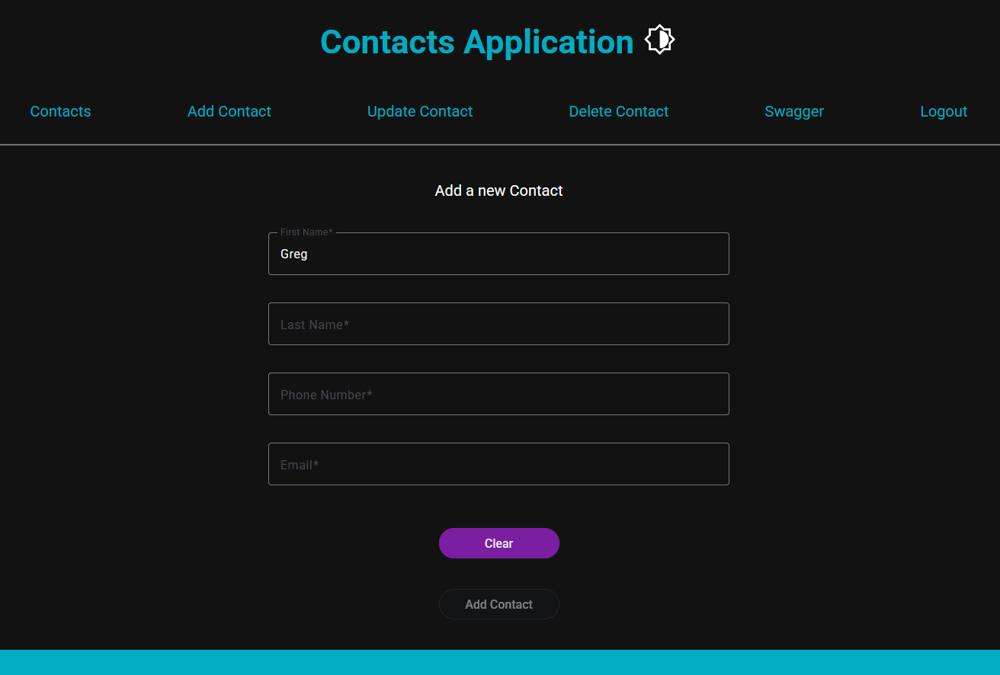

# Project name: contacts-app

### Frontend

- Angular 18, Nodejs 20, TypeScript, Material Design 3, ngx-toastr

### Backend

- Java 17, Micronaut, Gradle, Hibernate, Lombok, OpenAPI v3

### Other software

- PostgreSQL 16, git, Docker, Postman

### Basic information

- User: user
- Password: pass
- App base URL: localhost / 127.0.0.1
- Frontend port: 4200
- Backend port: 5000
- Swagger URL: localhost:5000/swagger-ui

## Angular basic commands

### Install files
npm install -g @angular/cli

### Create new project with <project_name>

'ng new my-angular-project' OR 'ng new my-angular-project --no-standalone --routing --ssr=false'

### Create component with <component_name>

```bash
ng generate component component-name
```

### Create service with <component_name>

```bash
ng generate service service/auth
```

### Create security class with <component_name>

```bash
ng generate guard auth
```

### Create basic configuration environments

```bash
ng generate environments
```

### Install toast messages

```bash
npm install ngx-toastr --save
```

### Install logger library

```bash
npm install --save ngx-logger
```

### Install loading spinner

> [!WARNING]
> Check if your Angular version is supported for ngx-spinner!

```bash
npm install ngx-spinner --save
```

### Install Bulma css framework (Optional)

```bash
npm install bulma
```

### Add Angular material theme (Optional)

```bash
ng add @angular/material
```

### Add Angular material icons (Optional)

```bash
npm install material-icons@latest
```

### Install cookies service (Optional)

```bash
npm install ngx-cookie-service
```

### Update the project to newer version (You could specify the version after @ or by using 'latest')

```bash
ng update @angular/core@18 @angular/cli@18
```

### Start the application

```bash
ng serve
```

### Run Angular tests

```bash
ng test
```

### Build application with specific environment configuration (development, production)

```bash
ng build --configuration production
```

## Gradle basic commands

### Build project

```bash
./gradlew build
```

### Build run

```bash
./gradlew run
```

### Run test

```bash
./gradlew test
```

### Debug

```bash
./gradlew assembleDebug  --warning-mode=all
```

```bash
./gradlew assembleDebug  --stacktrace
```

## Startup your project

### First create executable jar from backend

```bash
cd ./backend
./gradlew shadowJar
```

### Then start the container from root directory

```bash
cd ..
docker-compose up --build
```

## Contacts App Preview





