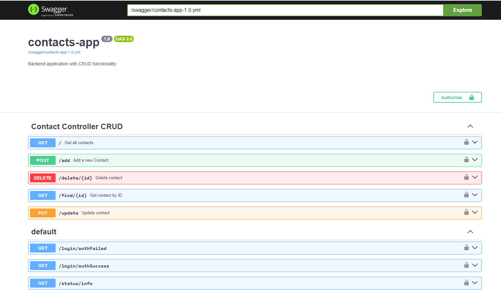

# Project name: contacts-app

### Frontend

- Angular 18, Nodejs 20, TypeScript, Material Design 3, ngx-toastr

### Backend

- Java 17, Micronaut, Gradle, Hibernate, Lombok, OpenAPI v3

### Other software

- PostgreSQL 16, git, Docker, Postman

### Basic information

- User: user
- Password: pass
- App base URL: localhost / 127.0.0.1
- Frontend port: 4200
- Backend port: 5000
- Swagger URL: localhost:5000/swagger-ui

## Angular basic commands

### Install files
npm install -g @angular/cli

### Create new project with <project_name>

'ng new my-angular-project' OR 'ng new my-angular-project --no-standalone --routing --ssr=false'

### Create component with <component_name>

ng generate component component-name

### Create service with <component_name>

ng generate service service/auth

### Create security class with <component_name>

ng generate guard auth

### Create basic configuration environments

ng generate environments

### Install toast messages

npm install ngx-toastr --save

### Install logger library

npm install --save ngx-logger

### Install loading spinner (Current supported version is Angular 17. Keep in mind that some features may not work!)

npm install ngx-spinner --save

### Add Angular material theme (Optional)

ng add @angular/material

### Install cookies service (Optional)

npm install ngx-cookie-service

### Start the application

ng serve

### Run Angular tests

ng test

### Build application with specific environment configuration (development, production)

ng build --configuration production

## Gradle basic commands

### Build project

./gradlew build

### Build run

./gradlew run

### Run test

./gradlew test

### Debug

./gradlew assembleDebug  --warning-mode=all

./gradlew assembleDebug  --stacktrace

## Startup your project

### First create executable jar from backend

cd ./backend

./gradlew shadowJar

### Then start the container from root directory

cd ..

docker-compose up --build

### Contacts App Preview

